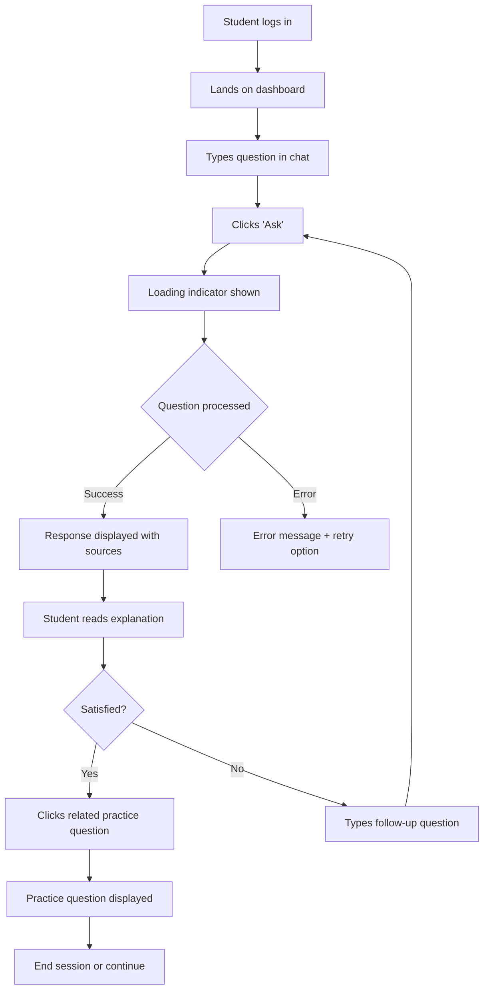
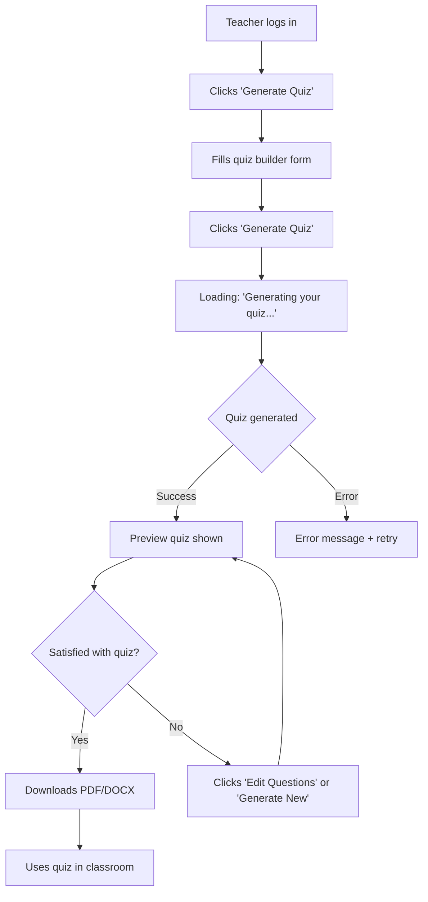

<artifact identifier="rep-architecture" type="text/markdown" title="Architecture Documentation">
# Architecture Overview

**Rwanda Education Platform (REP) - System Design**

This document provides a comprehensive overview of REP's technical architecture, design decisions, and system components.

---

## Table of Contents

- [Design Principles](#design-principles)
- [System Architecture](#system-architecture)
- [Component Overview](#component-overview)
- [Data Flow](#data-flow)
- [Technology Stack](#technology-stack)
- [Security Architecture](#security-architecture)
- [Scalability Considerations](#scalability-considerations)
- [Deployment Architecture](#deployment-architecture)

---

## Design Principles

REP's architecture is guided by the following core principles:

### 1. **Accessibility First**
- Mobile-first responsive design
- Optimized for low-bandwidth environments (2G/3G networks)
- Progressive enhancement for modern browsers
- Offline-capable (Post-MVP)

### 2. **Data Integrity**
- Single source of truth for educational content (PostgreSQL)
- Content provenance tracking (every AI response cites sources)
- Immutable official content with versioning
- Audit trails for critical operations

### 3. **Scalability**
- Horizontal scaling for API servers
- Caching layer (Redis) for frequently accessed content
- CDN integration for static assets
- Async task processing for heavy operations

### 4. **Security & Privacy**
- Role-based access control (RBAC)
- JWT-based authentication
- Data encryption at rest and in transit
- Ministry-grade security for sensitive educational data
- GDPR-compliant data handling

### 5. **Maintainability**
- Monolithic architecture for MVP (simpler deployment)
- Clear separation of concerns (frontend/backend)
- Comprehensive documentation
- Automated testing (unit, integration, e2e)

---

## System Architecture

### High-Level Architecture Diagram
```
┌─────────────────────────────────────────────────────────────────┐
│                         Client Layer                             │
│  ┌──────────────┐  ┌──────────────┐  ┌──────────────┐          │
│  │   Desktop    │  │    Tablet    │  │  Smartphone  │          │
│  │   Browser    │  │   Browser    │  │   Browser    │          │
│  └──────┬───────┘  └──────┬───────┘  └──────┬───────┘          │
│         │                  │                  │                   │
│         └──────────────────┼──────────────────┘                   │
│                            │                                      │
└────────────────────────────┼──────────────────────────────────────┘
                             │ HTTPS
                             │
┌────────────────────────────▼──────────────────────────────────────┐
│                    Frontend Application                           │
│  ┌────────────────────────────────────────────────────────┐      │
│  │              Next.js 14+ (React 18+)                   │      │
│  │  ┌─────────────┐  ┌─────────────┐  ┌─────────────┐   │      │
│  │  │   Pages     │  │ Components  │  │   Hooks     │   │      │
│  │  │  (Routes)   │  │   (UI)      │  │  (State)    │   │      │
│  │  └─────────────┘  └─────────────┘  └─────────────┘   │      │
│  │  ┌─────────────┐  ┌─────────────┐                    │      │
│  │  │   API       │  │   Context   │                    │      │
│  │  │  Client     │  │  Providers  │                    │      │
│  │  └─────────────┘  └─────────────┘                    │      │
│  └────────────────────────────────────────────────────────┘      │
└────────────────────────────┬──────────────────────────────────────┘
                             │ REST API (JSON)
                             │
┌────────────────────────────▼──────────────────────────────────────┐
│                    Backend Application                            │
│  ┌────────────────────────────────────────────────────────┐      │
│  │         Django 5.0+ / Django REST Framework            │      │
│  │  ┌─────────────┐  ┌─────────────┐  ┌─────────────┐   │      │
│  │  │    Auth     │  │   Content   │  │     AI      │   │      │
│  │  │   Service   │  │   Service   │  │  Orchestr.  │   │      │
│  │  └─────────────┘  └─────────────┘  └─────────────┘   │      │
│  │  ┌─────────────┐  ┌─────────────┐  ┌─────────────┐   │      │
│  │  │    User     │  │   Teacher   │  │   Student   │   │      │
│  │  │   Service   │  │   Service   │  │   Service   │   │      │
│  │  └─────────────┘  └─────────────┘  └─────────────┘   │      │
│  └────────────────────────────────────────────────────────┘      │
└───────┬──────────────────┬──────────────────┬─────────────────────┘
        │                  │                  │
        │                  │                  │
┌───────▼──────┐  ┌────────▼────────┐  ┌─────▼──────────────┐
│ PostgreSQL   │  │     Redis       │  │   AI Service       │
│              │  │                 │  │                    │
│ - Users      │  │ - Session Cache │  │ - External API     │
│ - Content    │  │ - Query Cache   │  │   (MVP)            │
│ - Metadata   │  │ - Rate Limiting │  │ - National Model   │
│ - Audit Logs │  │                 │  │   (Post-MVP)       │
└──────────────┘  └─────────────────┘  └────────────────────┘
```

---

## Component Overview

### Frontend Layer

**Technology**: Next.js 14+ (React 18+, TypeScript)

**Responsibilities**:
- Server-side rendering (SSR) for initial page loads
- Client-side routing for seamless navigation
- API communication via centralized client
- State management (React Context + custom hooks)
- Form validation and user input handling
- Responsive UI components

**Key Directories**:
```bash
frontend/
├── src/
│   ├── app/              # Next.js 14 app router
│   │   ├── (auth)/       # Authentication pages
│   │   ├── student/      # Student dashboard
│   │   └── teacher/      # Teacher dashboard
│   ├── components/       # Reusable UI components
│   │   ├── ui/           # Base components (buttons, inputs)
│   │   ├── chat/         # Chat interface
│   │   └── quiz/         # Quiz generator
│   ├── lib/              # Utilities and API client
│   ├── hooks/            # Custom React hooks
│   └── types/            # TypeScript definitions
```

### Backend Layer

**Technology**: Django 5.0+ / Django REST Framework

**Responsibilities**:
- RESTful API endpoints
- Authentication & authorization (JWT)
- Business logic orchestration
- Database operations (ORM)
- AI service integration
- Content processing and indexing
- Async task management (Celery)

**Key Apps**:
```bash
backend/
├── apps/
│   ├── users/            # User management, auth
│   ├── content/          # Content ingestion, storage
│   ├── chat/             # Chat/assistant endpoints
│   ├── quiz/             # Quiz generation
│   ├── analytics/        # Usage tracking (Post-MVP)
│   └── ai/               # AI service integration
├── core/                 # Shared utilities
├── config/               # Django settings
└── manage.py
```
## Data Layer
### PostgreSQL (Primary Database)
**Schema Overview:**
```sql
-- Core tables (simplified)

Users
├── id (PK)
├── email (unique)
├── role (student/teacher/admin)
├── school_id (FK, optional)
└── created_at

Schools
├── id (PK)
├── name
├── district
└── level (primary/secondary/university)

Content
├── id (PK)
├── title
├── subject
├── level (P1-P6, S1-S6, University)
├── content_type (exam/textbook/curriculum)
├── source (REB/NESA)
├── file_path
└── metadata (JSON)

ContentIndex
├── id (PK)
├── content_id (FK)
├── section_title
├── page_number
├── indexed_text (searchable)
└── embedding_vector (for semantic search, Post-MVP)

ChatSessions
├── id (PK)
├── user_id (FK)
├── subject
├── started_at
└── last_activity

ChatMessages
├── id (PK)
├── session_id (FK)
├── role (user/assistant)
├── content
├── sources (JSON array of content IDs)
└── created_at

QuizGenerations
├── id (PK)
├── teacher_id (FK)
├── subject
├── level
├── questions (JSON)
├── answer_key (JSON)
└── created_at
```

#### Redis (Cache Layer)

**Usage Patterns**:
- Session storage
- Content cache (frequently accessed exam papers)
- Rate limiting counters
- Query result caching
- Real-time user presence (Post-MVP)

**Key Patterns**:
```
session:{user_id}:{session_id}
content:exam:{subject}:{level}:{year}
rate_limit:{user_id}:{endpoint}
query_cache:{hash}
```

#### AI Service Layer
#### MVP Approach (External API)
**Integration Pattern:**

# Simplified example

```python
class AIService:
    def generate_explanation(self, query, context_docs):
        prompt = self._build_prompt(query, context_docs)
        response = external_api.complete(prompt)
        return self._parse_response(response)
    
    def _build_prompt(self, query, docs):
        return f"""
        Based on these official sources:
        {self._format_sources(docs)}
        
        Explain: {query}
        
        Provide a clear, step-by-step explanation.
        Cite sources using [Source: Document Title, Page X].
        """
```

#### Post-MVP Approach (National Model)

**In-House Model Strategy**:
- Fine-tuned model on Rwandan curriculum
- Multilingual support (English, Kinyarwanda, French)
- Hosted securely within infrastructure
- Optimized for educational use cases

[→ Full AI Model Strategy](docs/AI-Model-Strategy.md)

---

## Data Flow

### Student Query Flow
```
┌─────────┐
│ Student │
│  Types  │
│ Question│
└────┬────┘
     │
     ▼
┌─────────────────┐
│  Frontend       │
│  Validates &    │
│  Sends to API   │
└────┬────────────┘
     │ POST /api/chat/message
     ▼
┌─────────────────┐
│  Django View    │
│  1. Auth check  │
│  2. Rate limit  │
└────┬────────────┘
     │
     ▼
┌─────────────────┐
│  Chat Service   │
│  1. Store msg   │
│  2. Search docs │
└────┬────────────┘
     │
     ├──────────────┐
     ▼              ▼
┌─────────┐   ┌──────────┐
│ Content │   │   AI     │
│ Search  │   │ Service  │
│         │   │          │
│ Returns │   │ Generate │
│ relevant│   │ response │
│   docs  │   │          │
└────┬────┘   └─────┬────┘
     │              │
     └──────┬───────┘
            ▼
     ┌──────────────┐
     │   Response   │
     │   1. Text    │
     │   2. Sources │
     │   3. Related │
     └──────┬───────┘
            │
            ▼
     ┌──────────────┐
     │  Frontend    │
     │  Displays    │
     │  formatted   │
     │  response    │
     └──────────────┘
```

### Teacher Quiz Generation Flow
```
┌─────────┐
│ Teacher │
│ Selects │
│ Topic   │
└────┬────┘
     │
     ▼
┌─────────────────┐
│  Frontend       │
│  Quiz Builder   │
│  Form           │
└────┬────────────┘
     │ POST /api/quiz/generate
     │ {subject, level, count, difficulty}
     ▼
┌─────────────────┐
│  Django View    │
│  Permission     │
│  check (teacher)│
└────┬────────────┘
     │
     ▼
┌─────────────────┐
│  Quiz Service   │
│  1. Query       │
│     question DB │
│  2. Or generate │
│     via AI      │
└────┬────────────┘
     │
     ├──────────────┐
     ▼              ▼
┌─────────┐   ┌──────────┐
│Question │   │   AI     │
│  Bank   │   │ Service  │
│         │   │          │
│ SELECT  │   │ Generate │
│ similar │   │  novel   │
│questions│   │questions │
└────┬────┘   └─────┬────┘
     │              │
     └──────┬───────┘
            ▼
     ┌──────────────┐
     │  Quiz        │
     │  Formatter   │
     │  - Questions │
     │  - Answers   │
     │  - Rubric    │
     └──────┬───────┘
            │
            ▼
     ┌──────────────┐
     │  Store &     │
     │  Return      │
     │  Downloadable│
     │  format      │
     └──────┬───────┘
            │
            ▼
     ┌──────────────┐
     │  Frontend    │
     │  Preview &   │
     │  Download    │
     └──────────────┘
``` 

## Technology Stack

### Frontend

| Component | Technology | Version | Purpose |
|-----------|-----------|---------|---------|
| Framework | Next.js | 14+ | React framework with SSR |
| UI Library | React | 18+ | Component-based UI |
| Language | TypeScript | 5+ | Type safety |
| Styling | Tailwind CSS | 3+ | Utility-first CSS |
| State | React Context | - | Global state management |
| Forms | React Hook Form | 7+ | Form validation |
| HTTP Client | Axios | 1+ | API communication |
| Icons | Lucide React | - | Icon library |

### Backend

| Component | Technology | Version | Purpose |
|-----------|-----------|---------|---------|
| Framework | Django | 5.0+ | Web framework |
| API | Django REST Framework | 3.14+ | RESTful API |
| Database | PostgreSQL | 14+ | Primary data store |
| Cache | Redis | 7+ | Caching & sessions |
| Task Queue | Celery | 5+ | Async processing |
| Auth | Django SimpleJWT | - | JWT authentication |
| CORS | Django CORS Headers | - | Cross-origin requests |
| ORM | Django ORM | - | Database abstraction |

### Infrastructure

| Component | Technology | Purpose |
|-----------|-----------|---------|
| Web Server | Nginx | Reverse proxy, static files |
| App Server | Gunicorn | WSGI server for Django |
| Process Manager | Supervisor | Service management |
| Container | Docker | Containerization (optional) |
| CI/CD | GitHub Actions | Automated testing & deployment |

---

## Security Architecture

### Authentication & Authorization

**Authentication Flow**:

1. User submits credentials (email/password)
2. Backend validates against database
3. If valid, generate JWT (access + refresh tokens)
4. Frontend stores tokens securely (httpOnly cookies preferred)
5. Frontend includes access token in subsequent requests
6. Backend validates token on each request
7. Refresh token used to obtain new access token when expired

## Role-Based Access Control (RBAC):
### Simplified permission model
Roles:
- Student: Can access student dashboard, chat, past papers
- Teacher: Can access teacher dashboard, quiz generator, chat
- Admin: Can access all features + user management
- Ministry: Can access analytics dashboards (Post-MVP)

Permission Checks:
```python
@permission_required('teacher')
def generate_quiz(request):
    # Only teachers can generate quizzes
    pass
```

### Data Security

**Encryption**:
- TLS 1.3 for data in transit
- AES-256 for sensitive data at rest
- Password hashing: Argon2 (Django default)

**Input Validation**:
- Django form validation for all user inputs
- Parameterized queries (ORM) to prevent SQL injection
- Content Security Policy (CSP) headers
- XSS protection via React's auto-escaping

**Sensitive Data Handling**:
- Student personally identifiable information (PII) minimized
- Audit logs for all content access
- Data retention policies (comply with local regulations)
- Right to deletion (GDPR-compliant)

---

## Scalability Considerations

### Horizontal Scaling

**API Servers**:
- Stateless Django application servers
- Load balancer distributes requests
- Session data in Redis (not in-memory)
- Shared PostgreSQL database

**Scaling Pattern**:
```
        ┌───────────────┐
        │ Load Balancer │
        └───────┬───────┘
                │
        ┌───────┴───────┐
        │               │
    ┌───▼───┐       ┌───▼───┐
    │Server1│       │Server2│
    └───┬───┘       └───┬───┘
        │               │
        └───────┬───────┘
                │
          ┌─────▼─────┐
          │PostgreSQL │
          └───────────┘
```

### Caching Strategy

**Layer 1: Browser Cache**
- Static assets (CSS, JS, images)
- Cache-Control headers

**Layer 2: CDN**
- Static content delivery
- Geographically distributed (Post-MVP)

**Layer 3: Redis**
- API response caching
- Database query results
- Session storage

**Layer 4: Database**
- Indexed queries
- Materialized views for complex aggregations (Post-MVP)

### Database Optimization

- Indexed columns: `user_id`, `content_id`, `subject`, `level`
- Connection pooling (PgBouncer)
- Read replicas for analytics queries (Post-MVP)
- Partitioning large tables (chat messages, logs)

---

## Deployment Architecture

### MVP Deployment (Single Server)
```
┌────────────────────────────────────────────┐
│          Server (4 vCPU, 8GB RAM)          │
│                                            │
│  ┌──────────┐  ┌──────────┐  ┌─────────┐ │
│  │  Nginx   │  │ Next.js  │  │ Django  │ │
│  │  :80/443 │  │  :3000   │  │  :8000  │ │
│  └──────────┘  └──────────┘  └─────────┘ │
│                                            │
│  ┌──────────┐  ┌──────────┐              │
│  │PostgreSQL│  │  Redis   │              │
│  │  :5432   │  │  :6379   │              │
│  └──────────┘  └──────────┘              │
└────────────────────────────────────────────┘

```
### Post-MVP Deployment (Scalable)

```
┌─────────────┐
│   Cloudflare│
│     CDN     │
└──────┬──────┘
       │
┌──────▼──────────────────────────────┐
│     Load Balancer (Nginx)           │
└──────┬──────────────────────────────┘
       │
   ┌───┴────┬────────┬────────┐
   │        │        │        │
┌──▼──┐  ┌──▼──┐  ┌──▼──┐  ┌──▼──┐
│ App │  │ App │  │ App │  │ App │
│ Svr1│  │ Svr2│  │ Svr3│  │ Svr4│
└──┬──┘  └──┬──┘  └──┬──┘  └──┬──┘
   │        │        │        │
   └────────┴────┬───┴────────┘
                 │
       ┌─────────┴─────────┐
       │                   │
   ┌───▼────┐        ┌─────▼────┐
   │ Primary│        │  Redis   │
   │  DB    │        │ Cluster  │
   └───┬────┘        └──────────┘
       │
   ┌───▼────┐
   │ Read   │
   │Replicas│
   └────────┘
```
---

## Performance Targets

### MVP Performance Goals

| Metric | Target | Rationale |
|--------|--------|-----------|
| API Response Time (p95) | < 500ms | Acceptable for chat interactions |
| Page Load Time | < 3s on 3G | Mobile-first, low-bandwidth |
| Quiz Generation | < 10s | Teachers can wait briefly |
| Concurrent Users | 500+ | Pilot schools ~500 active users |
| Uptime | 99% | Educational context, not mission-critical |

### Post-MVP Performance Goals

| Metric | Target | Rationale |
|--------|--------|-----------|
| API Response Time (p95) | < 300ms | National scale demands speed |
| Page Load Time | < 2s on 3G | Improved optimization |
| Concurrent Users | 50,000+ | National rollout |
| Uptime | 99.9% | Critical educational infrastructure |

---

## Monitoring & Observability

### Metrics Collection

**Application Metrics**:
- Request rate, latency, error rate
- API endpoint performance
- Database query performance
- Cache hit/miss ratios

**Business Metrics**:
- Active users (daily/monthly)
- Chat sessions initiated
- Quizzes generated
- Content access patterns

**Infrastructure Metrics**:
- CPU, memory, disk usage
- Network throughput
- Database connections
- Redis memory usage

### Logging Strategy
```python
# Structured logging example
import structlog

logger = structlog.get_logger()

logger.info(
    "chat_message_processed",
    user_id=user.id,
    session_id=session.id,
    subject=subject,
    response_time_ms=elapsed,
    sources_count=len(sources)
)
```

**Log Levels**:
- **DEBUG**: Development troubleshooting
- **INFO**: Normal operations (requests, events)
- **WARNING**: Degraded performance, retries
- **ERROR**: Failed operations, exceptions
- **CRITICAL**: System failures

---

## Disaster Recovery

### Backup Strategy

**Database Backups**:
- Full backup: Daily at 2 AM EAT
- Incremental backups: Every 6 hours
- Retention: 30 days
- Offsite storage: AWS S3 / Azure Blob

**Content Backups**:
- Official curriculum files backed up weekly
- Immutable storage for compliance
- Version control for content updates

**Recovery Time Objectives**:
- RTO (Recovery Time Objective): 4 hours
- RPO (Recovery Point Objective): 6 hours

### Disaster Recovery Plan

1. **Database Failure**: Restore from latest backup, replay transaction logs
2. **Application Failure**: Redeploy from Git, rolling restart
3. **Data Center Failure**: Failover to secondary region (Post-MVP)

---

## Future Architecture Considerations

### Microservices Migration (Post-MVP)

As the platform scales nationally, consider:
- Breaking monolith into focused services
- Event-driven architecture (message queues)
- Service mesh for inter-service communication
- Independent scaling per service

**Potential Services**:
- User Service
- Content Service
- Chat/AI Service
- Analytics Service
- Notification Service

### Edge Computing (Post-MVP)

For offline-first features:
- Progressive Web App (PWA) with service workers
- Local-first data sync
- Edge caching for rural areas
- Offline AI inference (lightweight models)

---

## Architecture Decision Records (ADRs)

### ADR-001: Monolithic Architecture for MVP

**Status**: Accepted  
**Date**: 2025-01-15

**Context**: Need to launch MVP quickly with small team.

**Decision**: Deploy as monolithic Django + Next.js application.

**Consequences**:
- ✅ Faster development
- ✅ Simpler deployment
- ❌ Harder to scale individual components
- ❌ Tight coupling

**Mitigation**: Plan microservices migration for Post-MVP.

### ADR-002: External AI Service for MVP

**Status**: Accepted  
**Date**: 2025-01-20

**Context**: Insufficient data/resources to train custom model initially.

**Decision**: Use external AI API (e.g., Claude, GPT-4) with strict prompt engineering.

**Consequences**:
- ✅ Rapid implementation
- ✅ High-quality responses
- ❌ Dependency on external service
- ❌ Recurring costs
- ❌ Data sovereignty concerns

**Mitigation**: Build national model for Post-MVP phase.

### ADR-003: PostgreSQL as Primary Database

**Status**: Accepted  
**Date**: 2025-01-10

**Context**: Need reliable, ACID-compliant storage.

**Decision**: Use PostgreSQL for all structured data.

**Consequences**:
- ✅ Mature, battle-tested
- ✅ Rich feature set (JSON, full-text search)
- ✅ Strong Django ORM support
- ❌ Single point of failure (MVP)

**Mitigation**: Add read replicas and automated failover (Post-MVP).

---

## Conclusion

REP's architecture balances **simplicity** (for MVP launch), **scalability** (for national growth), and **security** (for educational data protection). The monolithic design enables rapid iteration while maintaining clear boundaries for future microservices migration.

**Key Takeaways**:
- Mobile-first, low-bandwidth optimized
- Security-first approach to student data
- Pragmatic AI integration (external → in-house)
- Clear migration path from MVP to national scale

For implementation details, see:
- [Backend Guide](Backend.md)
- [Frontend Guide](Frontend.md)
- [AI Model Strategy](AI-Model-Strategy.md)

---

**Last Updated**: 2025-01-25  
**Author**: REP Engineering Team  
**Status**: Living Document
</artifact>

---
```markdown
# File: docs/MVP.md
```

<artifact identifier="rep-mvp" type="text/markdown" title="MVP Specification">
# MVP Specification

**Rwanda Education Platform - Minimum Viable Product**

This document defines the scope, features, and success criteria for REP's MVP launch.

---

## Table of Contents

- [Mission Statement](#mission-statement)
- [MVP Goals](#mvp-goals)
- [Scope Definition](#scope-definition)
- [Core Features](#core-features)
- [User Flows](#user-flows)
- [Technical Requirements](#technical-requirements)
- [Success Metrics](#success-metrics)
- [Out of Scope](#out-of-scope)
- [Launch Plan](#launch-plan)

---

## Mission Statement

> **Provide a simple, reliable AI assistant that helps students practice past national exams and understand academic concepts in clear, logical steps, and helps teachers quickly generate in-class quizzes and explanations.**

The MVP operates in **English only** and serves as a proof-of-concept to validate educational impact before scaling nationally.

---

## MVP Goals

### Primary Objectives

1. **Validate Educational Value**: Demonstrate measurable learning improvements through pilot testing
2. **Establish Trust**: Show Ministry officials that AI can reliably cite official sources
3. **Prove Technical Feasibility**: Confirm system stability and performance in real school environments
4. **Gather User Feedback**: Collect insights to inform Post-MVP feature prioritization

### Non-Goals (MVP)

- ❌ Multilingual support (Kinyarwanda/French)
- ❌ Student progress tracking/analytics
- ❌ Teacher assignment workflows
- ❌ Parent/admin roles
- ❌ Mobile native apps
- ❌ Offline access
- ❌ Custom national AI model

---

## Scope Definition

### Included in MVP

| Category | Feature | Priority |
|----------|---------|----------|
| **Authentication** | Email/password registration & login | P0 |
| **Roles** | Student and Teacher roles | P0 |
| **Content** | REB/NESA past exam papers (indexed) | P0 |
| **Student AI** | Question answering with source citations | P0 |
| **Student AI** | Step-by-step explanations | P0 |
| **Student AI** | Practice question suggestions | P1 |
| **Teacher AI** | Quiz generation (topic-based) | P0 |
| **Teacher AI** | Answer key generation | P0 |
| **Teacher AI** | Concept explanations for lesson planning | P1 |
| **UI** | Responsive web interface | P0 |
| **UI** | Chat-style interaction | P0 |
| **UI** | Quiz builder form | P0 |

**Priority Definitions**:
- **P0**: Must have for launch
- **P1**: Should have if time permits
- **P2**: Nice to have, defer to Post-MVP

### Explicitly Excluded from MVP

- Student progress dashboards
- Assignment submission/grading
- Collaborative features (study groups, forums)
- Gamification (badges, leaderboards)
- Video/audio content
- Real-time notifications
- Advanced analytics

---

## Core Features

### 1. Authentication and Roles

#### User Registration

**Student Registration**:

***Required Fields:***

- Full Name
- Email
- Password (min 8 chars, complexity rules)
- School (dropdown, optional)
- Grade Level (P1-P6, S1-S6, University)

**Optional Fields:**

- Phone Number

**Teacher Registration**:

Required Fields:

- Full Name
- Email
- Password
- School (dropdown, required)
- Subjects Taught (multi-select)
- Grade Levels Taught (multi-select)

Verification:

- Manual approval by admin (MVP)
- Email verification (automatic)

#### Authentication Flow

1. User submits registration form
2. Backend validates data
3. Create user account (inactive until email verified)
4. Send verification email
5. User clicks verification link
6. Account activated
7. User can log in

**Security**:
- JWT tokens (access: 1hr, refresh: 7 days)
- Password hashing: Argon2
- Rate limiting: 5 login attempts per 15 minutes

---

### 2. Official Content Intake

#### Content Sources

**Target Materials**:
- REB past national exam papers (2015-2024)
- NESA past exam papers
- Approved textbook excerpts
- Official curriculum documents

**Subjects (MVP Priority)**:
- Mathematics
- Physics
- Chemistry
- Biology
- English Language

**Levels**:
- Primary: P5, P6
- Secondary: S3, S4, S5, S6 (O-Level & A-Level)
- University: Year 1-2 (selected courses)

#### Content Processing Pipeline

```
┌─────────────────┐
│ Raw PDF Files   │
│ (REB/NESA)      │
└────────┬────────┘
         │
         ▼
┌─────────────────┐
│ PDF Extraction  │
│ - Text (PyPDF2) │
│ - Images (OCR)  │
└────────┬────────┘
         │
         ▼
┌─────────────────┐
│ Section Parsing │
│ - Questions     │
│ - Solutions     │
│ - Metadata      │
└────────┬────────┘
         │
         ▼
┌─────────────────┐
│ Database Import │
│ - Content table │
│ - Index table   │
└────────┬────────┘
         │
         ▼
┌─────────────────┐
│ Search Indexing │
│ - Full-text     │
│ - Metadata tags │
└─────────────────┘
```

#### Metadata Schema
```json
{
  "content_id": "nesa_math_2023_s6_q15",
  "source": "NESA",
  "title": "2023 Mathematics National Exam - S6",
  "subject": "Mathematics",
  "level": "S6",
  "year": 2023,
  "question_number": 15,
  "topics": ["Calculus", "Integration"],
  "difficulty": "Hard",
  "file_path": "/content/exams/nesa/math/2023_s6.pdf",
  "page_number": 8
}
```

---

### 3. Student AI Assistant

#### Core Functionality

**Question Types Supported**:
1. **Concept Explanation**: "Explain photosynthesis"
2. **Problem Solving**: "How do I solve this quadratic equation?"
3. **Past Paper Practice**: "Show me S5 chemistry questions about acids"
4. **Step-by-Step Guidance**: "Break down this physics problem"

#### Interaction Flow

**Student Input**:

"I don't understand how to solve quadratic equations"

1. Frontend sends query to backend
2. Backend searches content database for relevant materials

   - **Search**: "quadratic equations" + level + subject
   - **Returns**: Top 5 relevant content items


3. Backend constructs prompt for AI:
"""
You are an educational assistant for Rwandan students.
Context (official sources):
[Content 1: REB Math Textbook, Chapter 5, Page 45]
[Content 2: NESA 2022 S4 Exam, Question 12]
Student Question: I don't understand how to solve quadratic equations
Provide:

    1. Clear, step-by-step explanation
    2. Simple analogy or real-world example
    3. Practice problem (if applicable)
    4. Cite sources using [Source: Title, Page]
"""


4. AI generates response
5. Backend formats response:

    - Main explanation text
    - Source citations (linked to original documents)
    - Related practice questions


6. Frontend displays formatted response

#### Response Format
```markdown
## Solving Quadratic Equations

A quadratic equation is any equation in the form ax² + bx + c = 0, where a, b, and c are numbers.

### Step 1: Identify the coefficients
Look at your equation and identify a, b, and c.
Example: 2x² + 5x - 3 = 0
- a = 2
- b = 5  
- c = -3

### Step 2: Use the quadratic formula
x = (-b ± √(b² - 4ac)) / 2a

### Step 3: Calculate
[Detailed calculation steps...]

### Practice This
Try solving: x² + 6x + 8 = 0

**Sources**:
- [REB Mathematics Textbook S4, Chapter 5, Pages 45-47]
- [NESA 2022 S4 Exam, Question 12]

**Related Questions**:
- [NESA 2021 S4 Q8: Quadratic word problem]
- [REB Practice S4: Completing the square]
```

#### Quality Controls

**Source Citation Rules**:
- Every factual claim must cite a source
- No unsourced information (prevents hallucinations)
- Sources linked to original documents (when available)

**Response Constraints**:
- Maximum 500 words per explanation
- Language: Simple English (B1 level)
- Avoid jargon without definition
- Include visual aids (ASCII diagrams, when helpful)

**Safety Filters**:
- No inappropriate content
- No exam answer leaking (for upcoming exams)
- No encouragement of cheating

---

### 4. Teacher AI Assistant

#### Core Functionality

**Teacher Tools**:
1. **Quiz Generation**: Create custom quizzes from topics
2. **Answer Key Generation**: Automatic answer keys with explanations
3. **Concept Explanation**: Get teaching notes for difficult topics
4. **Past Paper Curation**: Find relevant exam questions by topic


## Teacher Quiz Generation Workflow

### 1. Teacher Input (Form)
- **Subject:** Mathematics
- **Level:** S4
- **Topic:** Quadratic Equations
- **Number of Questions:** 10
- **Difficulty:** Mixed
- **Question Types:**
  - Multiple choice (5)
  - Short answer (3)
  - Long answer (2)

### 2. Backend Processing
1. Search content database for relevant **Quadratic Equation** questions
2.  Filter questions by **level (S4)** and **difficulty**
3. **If insufficient questions:**
    -   Use AI to generate novel questions
    -   Ensure questions align with national curriculum
4. Generate **answer key**
5. Add **teacher notes**:
      - Common mistakes
      - Teaching tips
      - Step-by-step explanations

## Output (Downloadable PDF/DOCX):

```
┌─────────────────────────────────────┐
│ Mathematics Quiz - S4               │
│ Topic: Quadratic Equations          │
│ Date: 2025-02-15                    │
│                                     │
│ Name: ____________  Class: _______  │
│                                     │
│ SECTION A: Multiple Choice (5 pts)  │
│ 1. Solve x² - 5x + 6 = 0            │
│    a) x = 2, 3                      │
│    b) x = -2, -3                    │
│    c) x = 1, 6                      │
│    d) x = -1, -6                    │
│                                     │
│ [9 more questions...]               │
│                                     │
│ ANSWER KEY (Separate Page)          │
│ 1. a) x = 2, 3                      │
│    Explanation: Factor as (x-2)(x-3)│
│    Common mistake: Sign errors      │
│ [...]                               │
└─────────────────────────────────────┘
```

#### **Teaching Notes Feature**

**Teacher Query**:
"How can I explain integration to S6 students who struggle with it?"
AI Response:
```
┌─────────────────────────────────────────────┐
│ Teaching Integration: Lesson Plan Outline   │
│                                             │
│ 1. Start with Real-World Context            │
│    - Finding area under a curve             │
│    - Example: Distance from velocity graph  │
│                                             │
│ 2. Visual Approach                          │
│    - Draw rectangles under curve            │
│    - Show Riemann sum concept               │
│                                             │
│ 3. Connect to Reverse Differentiation       │
│    - "Integration undoes differentiation"   │
│    - Practice: d/dx(x²) vs ∫2x dx           │
│                                             │
│ 4. Common Student Mistakes                  │
│    - Forgetting "+ C" constant              │
│    - Confusing integration and summation    │
│                                             │
│ 5. Practice Problems (Easy → Hard)          │
│    - [Links to past exam questions]         │
│                                             │
│ Sources: REB Calculus Guide, NESA Marking   │
│          Schemes 2020-2023                  │
└─────────────────────────────────────────────┘
```


### 5. User Interface

#### Design Principles

- **Mobile-First**: 80% of Rwandan users access via smartphone
- **Low-Bandwidth**: Minimal assets, aggressive caching
- **Accessibility**: WCAG 2.1 AA compliance
- **Clarity**: Clean, uncluttered interface

#### Key Screens

**1. Homepage (Unauthenticated)**

```
┌─────────────────────────────────────┐
│  [REP Logo]  Rwanda Education       │
│              Platform               │
│                                     │
│  Empowering Rwandan learners with   │
│  AI-powered educational support     │
│                                     │
│  [Login]  [Register as Student]     │
│          [Register as Teacher]      │
│                                     │
│  Trusted by:                        │
│  [REB Logo] [NESA Logo]             │
└─────────────────────────────────────┘
```

**2. Student Dashboard**

```
┌─────────────────────────────────────┐
│ [Menu] Rwanda Education Platform    │
│                                     │
│ Hello, Aline! [Profile] [Logout]    │
│                                     │
│ ┌─────────────────────────────────┐ │
│ │ What would you like to learn?   │ │
│ │ [Type your question here...]    │ │
│ │                            [Ask]│ │
│ └─────────────────────────────────┘ │
│                                     │
│ Quick Access:                       │
│ [Mathematics] [Physics] [Chemistry] │
│                                     │
│ Recent Questions:                   │
│ • Solving quadratic equations       │
│ • Understanding photosynthesis      │
│ • Newton's laws of motion           │
│                                     │
│ Practice Exams:                     │
│ • [S3 Math 2023] [S3 Physics 2022]  │
└─────────────────────────────────────┘
```

**3. Chat Interface (Student)**

```
┌─────────────────────────────────────┐
│ ← Back to Dashboard                 │
│                                     │
│ Mathematics Chat Session            │
│                                     │
│ ┌─────────────────────────────────┐ │
│ │ You:                            │ │
│ │ I don't understand how to solve │ │
│ │ quadratic equations             │ │
│ │                       10:15 AM  │ │
│ └─────────────────────────────────┘ │
│                                     │
│ ┌─────────────────────────────────┐ │
│ │ REP Assistant:                  │ │
│ │ Let me explain step by step...  │ │
│ │ [Explanation content]           │ │
│ │                                 │ │
│ │ Sources:                        │ │
│ │ • [REB Math Textbook Ch 5]      │ │
│ │ • [NESA 2022 S4 Exam Q12]       │ │
│ │                                 │ │
│ │ Try this practice problem:      │ │
│ │ [Problem shown]                 │ │
│ │                       10:15 AM  │ │
│ └─────────────────────────────────┘ │
│                                     │
│ [Type your message...]        [Send]│
└─────────────────────────────────────┘
```
**4. Teacher Dashboard**
```
┌─────────────────────────────────────┐
│ [Menu] Rwanda Education Platform    │
│                                     │
│ Hello, Teacher Jean! [Profile]      │
│                                     │
│ ┌─────────────────┐ ┌──────────────┐│
│ │ Generate Quiz   │ │ Get Teaching ││
│ │                 │ │ Notes        ││
│ │ Create custom   │ │ Explain      ││
│ │ assessments     │ │ concepts     ││
│ │                 │ │              ││
│ │ [Start]         │ │ [Start]      ││
│ └─────────────────┘ └──────────────┘│
│                                     │
│ Recent Quizzes:                     │
│ • S4 Math: Quadratic Eq. (10 Qs)    │
│ • S5 Physics: Forces (15 Qs)        │
│                                     │
│ Past Exam Library:                  │
│ [Search by subject, level, year...] │
│                                     │
└─────────────────────────────────────┘
```
**5. Quiz Builder (Teacher)**

```
┌─────────────────────────────────────┐
│ Generate Quiz                       │
│                                     │
│ Subject:       [Mathematics    ▼]   │
│ Level:         [S4             ▼]   │
│ Topic:         [Quadratic Equations]│
│ Number of Questions: [10]           │
│                                     │
│ Difficulty:                         │
│  ○ Easy  ● Mixed  ○ Hard            │
│                                     │
│ Question Types:                     │
│  ☑ Multiple Choice  [5]             │
│  ☑ Short Answer     [3]             │
│  ☑ Long Answer      [2]             │
│                                     │
│ [Generate Quiz]                     │
│                                     │
│ ⏱ Estimated time: 30 seconds        │
└─────────────────────────────────────┘
```
**After generation:**

```
┌─────────────────────────────────────┐
│ Quiz Generated! ✓                   │
│                                     │
│ Preview:                            │
│ [Quiz content preview...]           │
│                                     │
│ [Download PDF] [Download DOCX]      │
│ [Edit Questions] [Generate New]     │
└─────────────────────────────────────┘
```

---

## User Flows

### Student: Asking a Question


### Teacher: Generating a Quiz


---

## Technical Requirements

### Performance Requirements

| Metric | Target | Measurement |
|--------|--------|-------------|
| Page Load Time | < 3s on 3G | Lighthouse audit |
| API Response Time (Chat) | < 1s (p95) | Server logs |
| Quiz Generation Time | < 15s | Server logs |
| Concurrent Users | 500+ | Load testing |
| Database Query Time | < 100ms (p95) | Django Debug Toolbar |

### Browser Support

- **Desktop**: Chrome 90+, Firefox 88+, Safari 14+, Edge 90+
- **Mobile**: Chrome Mobile, Safari iOS 14+
- **Not Supported**: Internet Explorer

### Accessibility Requirements

- WCAG 2.1 Level AA compliance
- Keyboard navigation support
- Screen reader compatibility
- Sufficient color contrast (4.5:1 minimum)
- Alt text for all images

### Security Requirements

- HTTPS only (TLS 1.3)
- Password complexity: min 8 chars, uppercase, lowercase, number
- Rate limiting: 100 requests/min per user
- SQL injection prevention (parameterized queries)
- XSS prevention (input sanitization)
- CSRF protection (Django middleware)

---

## Success Metrics

### Primary Success Indicators

**Adoption Metrics** (End of pilot, 3 months):
- ✅ 300+ registered users (students + teachers)
- ✅ 70%+ of registered users active weekly
- ✅ Average 5+ chat sessions per active student per week
- ✅ Average 3+ quizzes generated per active teacher per week

**Satisfaction Metrics** (User surveys):
- ✅ 70%+ of students rate explanations as "helpful" or "very helpful"
- ✅ 80%+ of teachers rate quiz generator as "saves time"
- ✅ Net Promoter Score (NPS) > 40

**Quality Metrics** (Content review):
- ✅ 95%+ of AI responses correctly cite sources
- ✅ < 5% hallucination rate (unsourced claims)
- ✅ Average explanation clarity score: 4/5 (expert review)

### Secondary Success Indicators

**Engagement Metrics**:
- Average session duration: 10+ minutes
- Follow-up question rate: 40%+ (students ask follow-ups)
- Quiz reuse rate: 30%+ (teachers reuse generated quizzes)

**Technical Metrics**:
- System uptime: 99%+
- Average response time < 1s
- Zero critical security incidents

---

## Out of Scope (MVP)

The following features are explicitly **not included** in MVP and will be considered for Post-MVP:

### Student Features (Post-MVP)
- Personalized learning paths
- Progress tracking/dashboards
- Gamification (badges, points, leaderboards)
- Study groups/peer collaboration
- Video/audio content
- Mobile native apps
- Offline access
- Push notifications

### Teacher Features (Post-MVP)
- Assignment creation/submission
- Student performance analytics
- Gradebook/grading tools
- Lesson plan templates
- Resource library (shareable)
- Class management
- Parent communication

### Platform Features (Post-MVP)
- Multilingual support (Kinyarwanda, French)
- Parent/admin/ministry roles
- Analytics dashboards (ministry)
- Integration with school management systems
- Custom national AI model
- Advanced search (semantic, vector-based)
- Content authoring tools

---

## Launch Plan

### Phase 1: Internal Alpha (2 weeks)

**Objectives**:
- Verify all core features functional
- Identify critical bugs
- Validate content quality

**Activities**:
- Team testing (5 internal users)
- Performance testing (simulated load)
- Security audit (basic)
- Content review (20 sample interactions)

**Exit Criteria**:
- Zero P0 bugs
- All core user flows complete
- Performance targets met

### Phase 2: Closed Beta (4 weeks)

**Objectives**:
- Test with real users
- Gather qualitative feedback
- Validate educational value

**Activities**:
- Recruit 50 beta users (30 students, 20 teachers)
- Weekly feedback surveys
- Usage analytics monitoring
- Bug fixing and iteration

**Exit Criteria**:
- 70%+ satisfaction rate
- < 10 P1 bugs
- System stability confirmed

### Phase 3: Pilot Launch (3 months)

**Objectives**:
- Scale to 3 pilot schools
- Measure educational impact
- Prepare for national rollout

**Activities**:
- Deploy to 3 schools (~500 users)
- Monthly teacher training sessions
- Bi-weekly user surveys
- Impact assessment (pre/post tests)

**Success Criteria**:
- All primary success metrics met
- Positive feedback from Ministry
- Clear path to Post-MVP funding

### Phase 4: Public Launch

**Objectives**:
- Open registration to all Rwandan schools
- Scale infrastructure
- Begin Post-MVP development

**Prerequisites**:
- Pilot success confirmed
- Ministry approval secured
- Infrastructure scaled (500 → 5,000+ users)

---

## Risk Mitigation

### Technical Risks

| Risk | Likelihood | Impact | Mitigation |
|------|-----------|--------|------------|
| AI service outage | Medium | High | Graceful degradation, cached responses |
| Performance issues at scale | Medium | High | Load testing, caching, CDN |
| Content quality (hallucinations) | Low | High | Strict prompt engineering, source citation enforcement |

### User Adoption Risks

| Risk | Likelihood | Impact | Mitigation |
|------|-----------|--------|------------|
| Teachers don't trust AI-generated quizzes | Medium | High | Manual review option, testimonials, training |
| Students prefer human tutors | Low | Medium | Position as supplement, not replacement |
| Low digital literacy | Medium | Medium | Simple UI, video tutorials, school training |

### Organizational Risks

| Risk | Likelihood | Impact | Mitigation |
|------|-----------|--------|------------|
| Ministry doesn't approve for expansion | Low | Critical | Transparent communication, pilot success focus |
| Insufficient funding for Post-MVP | Medium | High | Diverse funding sources, phased development |

---

## Conclusion

The REP MVP is intentionally narrow in scope to enable rapid validation of the platform's core value proposition: **AI-powered learning support grounded in official educational materials**. By focusing on English-only, web-based access with two core user roles, we can launch quickly, gather real-world feedback, and build trust with the Ministry of Education and pilot schools.

## Key MVP Principles:

- ✅ Simple: Two roles, one language, clear features
- ✅ Reliable: Source-backed responses, no hallucinations
- ✅ Valuable: Measurable time savings and learning improvements
- ✅ Scalable: Architecture ready for Post-MVP expansion

### Next Steps:

1. Complete MVP development (Target: Q1 2025)
2. Internal testing and refinement (2 weeks)
3. Closed beta with 50 users (4 weeks)
4. Pilot launch in 3 schools (3 months)
5. Evaluate success metrics and iterate
6. Secure Ministry approval for national expansion


For Post-MVP features and national scale planning, see [Post-MVP Vision](Post-MVP-Vision.md). \
**Last Updated**: 2025-01-25 \
**Status**: Active Development \
**Target Launch**: Q2 2025
</artifact>
